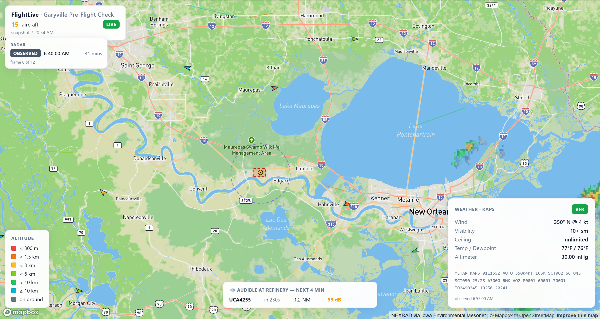

# FlightLive

A pre-flight check tool for drone operators flying near Marathon Garyville
refinery (Louisiana). One page, three live data sources, three pieces of
derived intelligence — everything a Part 107 pilot needs in the 30 seconds
before pressing launch on the controller.



[](https://codespaces.new/zach333miller/FlightLive?quickstart=1)

> ⚠️ **Portfolio demo, not an operational tool.** Even with multi-source
> ADS-B fusion, free public aggregators run 5–15 seconds behind real time —
> too stale to actually bet a flight-safety decision on. For real Part 107
> ops, cross-reference [B4UFLY](https://www.faa.gov/uas/getting_started/b4ufly)
> and a paid commercial feed.

## Why this exists

I fly daily LAANC missions at the Marathon Garyville refinery via Bronto
Industrial. The standard pre-flight workflow is to juggle four tabs:
B4UFLY for airspace, an aviation weather site for METARs, NOAA for radar,
and ADS-B Exchange or FlightAware for nearby traffic. This consolidates
that into a single view at the refinery's GPS coordinates.

It was also a deliberate ramp project on the exact stack
[Air Space Intelligence](https://www.airspace-intelligence.com/) builds on
(Rust + React + WebSockets) — going from zero Rust experience to a working
full-stack app in one session.

## What's on screen

| Layer | Source |
|---|---|
| Live aircraft positions, heading-aligned arrows, color-coded by altitude band | OpenSky Network API (OAuth2) |
| Per-aircraft flight trail (~80 s of recent history) | Server-side ring buffer |
| Behavior label per aircraft (CRUISE / APPROACH / HOLDING / HOVERING / CLIMBING / DESCENDING / TAXIING / ENROUTE) | Rust classifier over trajectory history |
| Pairwise conflict detection (3 NM / 1000 ft, at t=0 and t=60 s after dead-reckoning) | Rust spatial routine |
| Acoustic prediction — "which aircraft will be loud at the refinery in the next 4 minutes" | Slant-distance attenuation + per-class source-noise model |
| METAR weather card (flight category, wind, visibility, ceiling, temp/dewpoint, altimeter, raw text) | aviationweather.gov — KAPS (Reserve LA) |
| Animated NEXRAD precipitation radar — last 60 min in 5-min frames | Iowa State Environmental Mesonet |
| Marathon Garyville polygon + 5 NM drone-ops boundary | Hand-defined GeoJSON |

The map view is locked to the OpenSky bounding box around Garyville — no
zoom, no pan, no UI to fiddle with. Open the page, glance, decide.

## Stack

| Layer | Tech |
|---|---|
| Backend | Rust 1.95 · Axum 0.7 (with `ws`) · `tokio` (full) · `serde` · `reqwest` · `tower-http` |
| Frontend | React 18 · TypeScript · Vite · Mapbox GL JS |
| Data | OpenSky · aviationweather.gov · Iowa State IEM |

## Architecture

```
                ┌─────────────────────────────────────────────┐
                │  External feeds (10s / 5min cadences)       │
                │  · OpenSky /api/states/all  (OAuth2)        │
                │  · aviationweather.gov /api/data/metar      │
                │  · IEM NEXRAD tile cache  (front-end fetch) │
                └─────────────────────┬───────────────────────┘
                                      │
              ┌───────────────────────▼───────────────────────┐
              │  Rust backend (port 3001)                     │
              │                                               │
              │  fetcher_task  (10s)                          │
              │    ├ writes Arc<RwLock<HistoryMap>>           │
              │    ├ classifies Behavior over history         │
              │    ├ detects conflicts (t=0 & t=60s)          │
              │    ├ predicts audible-at-refinery events      │
              │    ├ joins latest weather snapshot            │
              │    └ writes cache + broadcasts → WS clients   │
              │                                               │
              │  weather_task  (5 min)                        │
              │    └ KAPS METAR → Arc<RwLock<Option<Weather>>>│
              │                                               │
              │  /api/aircraft   reads cache                  │
              │  /ws             snapshot stream              │
              └────────────────────┬──────────────────────────┘
                                   │ WS frames
              ┌────────────────────▼──────────────────────────┐
              │  React + Mapbox (Vite dev server, prod build) │
              │  · light-v11 basemap, locked bounding box     │
              │  · WS subscriber → state                      │
              │  · requestAnimationFrame loop dead-reckons    │
              │    marker positions + trail polylines         │
              │  · IEM radar tiles cycled at 1.4 fps          │
              │  · Side panel on marker click                 │
              └───────────────────────────────────────────────┘
```

## Rust patterns showcased

- `Arc<RwLock<…>>` shared state with many readers + occasional writer
- `tokio::sync::broadcast` fan-out from one producer to N WebSocket sessions
- `tokio::select!` to multiplex broadcast receive with client disconnect
- `tokio::spawn` for parallel fetcher and weather tasks
- `Result<T, E>` with the `?` operator and `map_err` for clean error chains
- `serde_json::Value` + `filter_map` for tolerant decode of OpenSky's
  heterogeneous positional arrays
- `serde(rename)` + `serde(rename_all)` to map the aviationweather.gov JSON
- OAuth2 client-credentials token exchange + cached bearer token
- Module split: `analysis` / `narrator` / `opensky` / `types` / `weather` / `main`
- Pure-function spatial math (haversine, dead-reckoning) — unit-testable
- Bounded ring buffers (`VecDeque<TrackPoint>`) for per-aircraft history

## Frontend patterns

- WebSocket subscriber with auto-reconnect
- Mutable non-React state in `useRef` (Mapbox map, marker map, animation handle)
- Mapbox GL JS sources: `geojson` for trails / refinery / conflicts / drone ring,
  `raster` for the animated radar
- `requestAnimationFrame` dead-reckoning loop: smooth marker glide between
  10-second OpenSky updates + trail polyline last-vertex extends to the
  reckoned position so the line never detaches from the plane
- Behavior-aware visual styling (badge color, marker color band)
- Locked map view (`interactive: false`, `bounds` + `fitBoundsOptions`) so the
  user can't accidentally pan/zoom away from the refinery

## Running locally

```bash
# 1. Backend (uses anonymous OpenSky tier by default — caps at ~100 req/day)
cd backend
cargo run
# Or with credentials for the 4,000 req/day tier:
#   OPENSKY_CLIENT_ID=…  OPENSKY_CLIENT_SECRET=…  cargo run

# 2. Frontend
cd frontend
cp .env.example .env       # then edit and paste your Mapbox public token
npm install
npm run dev                # opens at first free port from 5173
```

Visit the Vite URL. The map populates within ~10 s of backend startup
(first OpenSky fetch + first METAR fetch).

## Standalone executable

The release build embeds the compiled React bundle inside the Rust binary
via [`rust-embed`](https://crates.io/crates/rust-embed). The result is a
single ~6 MB `.exe` that boots the API, serves the SPA from the same
origin, and auto-opens your default browser on launch. No Node, no Vite,
no separate frontend server.

```bash
# 1. Build the frontend bundle (Vite inlines VITE_MAPBOX_TOKEN at build time)
cd frontend
npm run build

# 2. Build the release binary — rust-embed picks up frontend/dist/
cd ../backend
cargo build --release
# → backend/target/release/flightlive.exe
```

To run with the higher OpenSky quota, set the OAuth2 credentials in the
parent shell before launching the .exe:

```bash
OPENSKY_CLIENT_ID=…@gmail.com-api-client OPENSKY_CLIENT_SECRET=… ./flightlive.exe
```

Without those env vars the binary falls back to OpenSky's anonymous tier
(~100 req/day) and everything else still works.

## Endpoints

| Method | Path | Description |
|---|---|---|
| GET | `/api/health` | `{ok: true}` |
| GET | `/api/aircraft` | Latest cached `Snapshot` (aircraft + conflicts + audible events + weather) |
| GET | `/ws` | Snapshot stream — one frame per fetcher tick |

## OpenSky API setup

OpenSky migrated from HTTP Basic Auth to OAuth2 Client Credentials in
2024-25. To get authenticated access (and the 4,000 req/day quota
instead of ~100):

1. Create a free account at https://opensky-network.org/
2. Go to your account page → API Client → click **Reset Credential**
3. Copy the `clientId` and `clientSecret` (you only see the secret once)
4. Set them as env vars before running `cargo run`:
   `OPENSKY_CLIENT_ID=…@gmail.com-api-client`
   `OPENSKY_CLIENT_SECRET=…`

The backend's `opensky.rs` handles the token exchange against the
Keycloak endpoint at `auth.opensky-network.org` and caches the bearer
token until 30 s before its expiry.

## License

MIT
